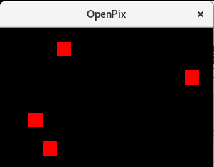
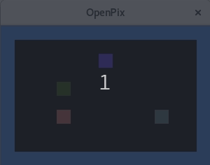

# OpenPix
A pixel based game engine for embedded gaming and ascii-nerds

[](https://travis-ci.org/mezorian/OpenPix) [](https://coveralls.io/github/mezorian/OpenPix?branch=master)

```

                         ,.
                        (_|,.
                       ,' /, )_______   _
                    __j o``-'        `.'-)'
                   (")      Open       \'
                    `-j       Pix      |
                      `-._(           /
                         |_\  |--^.  /
                        /_]'|_| /_)_/
                           /_]'  /_]'
```

The OpenPixGameEngine provides basic structures and functions to create a 2-dimensional game-engine with a pixMap (2-dim. vector) of Pix-Objects

 - init()
 - readInputs()
 - executeGameLogic();

The OpenPixGameEngine mainly consists of three components:

 1. pixMap : an 2-dimensional array of Pix-Objects which have to be displayed by the OutputDrivers
 2. pixObjects : an array of all PixObjects which are in the game
 3. pixMapOutputDriver : a outputdriver which outputs the current state of the pixMap to an output-device
 
A Pix can have several properties (e.g. colors) which specify how it is displayed on the output device.
A PixObject is a collection of Pix(s) which specify a object which can move and interact (e.g. collide) with other PixObjects within the pixMap.
A PixMapOutputDriver is an implementation of displaying the pixMap to any kind of output-device (e.g. a LED-matrix, a GUI or a ASCII console-output)
 
ATTENTION : The OpenPixGameEngine-class is not intended for direct usage. To create your own game inherit from this class and implement




